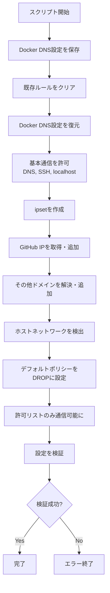

# Devcontainer設定ガイド（初学者向け）

このディレクトリには、VS CodeのDevcontainer機能を使用して開発環境をセットアップするための設定ファイルが含まれています。

## 📁 ファイル構成

- **devcontainer.json**: Devcontainerの主要な設定ファイル
- **Dockerfile**: コンテナイメージのビルド手順を定義するファイル（プロジェクトルートディレクトリに配置）
- **init-firewall.sh**: ファイアウォール初期化スクリプト（プロジェクトルートディレクトリに配置）

## 🤔 Devcontainerとは？

Devcontainer（Development Container）は、Dockerコンテナを使用して一貫した開発環境を作成する仕組みです。

### メリット

- **環境の統一**: チーム全員が同じ開発環境で作業できる
- **クリーンな環境**: ホストマシンを汚さずに開発できる
- **簡単なセットアップ**: 複雑な環境構築が自動化される
- **再現性**: いつでも同じ環境を再現できる

## ⚙️ devcontainer.json の設定内容

### 基本設定

#### コンテナ名
```json
"name": "Claude Code Sandbox"
```
VS Codeのリモートエクスプローラーに表示される名前です。

#### ビルド設定
```json
"build": {
    "dockerfile": "Dockerfile",
    "args": { ... }
}
```
- **dockerfile**: 使用するDockerfileを指定
- **args**: Dockerfileに渡すビルド時引数
  - `TZ`: タイムゾーン（日本の場合は`Asia/Tokyo`など）
  - `CLAUDE_CODE_VERSION`: Claude Codeのバージョン
  - `GIT_DELTA_VERSION`: Git差分表示ツールのバージョン
  - `ZSH_IN_DOCKER_VERSION`: Zshシェルの設定バージョン

### セキュリティ設定

#### Docker実行時の権限
```json
"runArgs": [
    "--cap-add=NET_ADMIN",
    "--cap-add=NET_RAW"
]
```
- **NET_ADMIN**: ネットワーク管理機能（ファイアウォール設定などに必要）
- **NET_RAW**: RAWソケット通信許可（`ping`コマンドなどに必要）

### VS Code統合設定

#### 自動インストールされる拡張機能
```json
"extensions": [
    "anthropic.claude-code",           // AI支援コーディング
    "dbaeumer.vscode-eslint",          // JavaScriptコード品質チェック
    "esbenp.prettier-vscode",          // コード整形ツール
    "eamodio.gitlens"                  // Git機能拡張
]
```

#### エディタ設定
- **保存時自動フォーマット**: ファイル保存時に自動的にコードを整形
- **ESLint自動修正**: コード品質の問題を自動修正
- **デフォルトターミナル**: Zshシェルを使用

### ユーザー設定

```json
"remoteUser": "node"
```
コンテナ内で`node`ユーザーとして実行されます。root権限が必要な操作には`sudo`を使用します。

### データ永続化

#### ボリュームマウント
```json
"mounts": [
    "source=claude-code-bashhistory-${devcontainerId},target=/commandhistory,type=volume",
    "source=claude-code-config-${devcontainerId},target=/home/node/.claude,type=volume"
]
```
- **コマンド履歴**: ターミナルのコマンド履歴を保存
- **Claude設定**: Claude関連の設定を保存

これらのデータはコンテナを削除しても保持されます。

### 環境変数

```json
"containerEnv": {
    "NODE_OPTIONS": "--max-old-space-size=4096",
    "CLAUDE_CONFIG_DIR": "/home/node/.claude",
    "POWERLEVEL9K_DISABLE_GITSTATUS": "true"
}
```
- **NODE_OPTIONS**: Node.jsに4GBのメモリを割り当て
- **CLAUDE_CONFIG_DIR**: Claude設定ディレクトリのパス
- **POWERLEVEL9K_DISABLE_GITSTATUS**: ターミナルのGit表示を無効化（高速化）

### ワークスペース設定

```json
"workspaceMount": "source=${localWorkspaceFolder},target=/workspace,type=bind,consistency=delegated",
"workspaceFolder": "/workspace"
```
プロジェクトフォルダがコンテナ内の`/workspace`にマウントされます。

### 起動時の処理

```json
"postStartCommand": "sudo /usr/local/bin/init-firewall.sh",
"waitFor": "postStartCommand"
```
コンテナ起動後、ファイアウォール初期化スクリプトを実行します。この処理が完了するまでVS Codeは待機します。

## ⚙️ Dockerfile の設定内容

`Dockerfile`は、開発コンテナのイメージをビルドするための設計図です。このファイルで開発環境に必要なすべてのツールや設定を定義しています。

### ベースイメージ

```dockerfile
FROM node:20
```
Node.js 20が含まれる公式イメージをベースとして使用します。

### インストールされるツール

#### 基本的な開発ツール
- **git**: バージョン管理システム
- **zsh**: 高機能なシェル（デフォルトシェル）
- **fzf**: ファジーファインダー（高速なファイル検索）
- **nano/vim**: テキストエディタ
- **gh**: GitHub CLI（コマンドラインからGitHub操作）

#### ネットワーク・セキュリティツール
- **iptables**: ファイアウォール管理
- **ipset**: IPアドレスセット管理
- **iproute2**: ネットワーク設定
- **dnsutils**: DNS関連ツール（digコマンドなど）

#### その他のツール
- **jq**: JSON処理ツール
- **git-delta**: Git差分の見やすい表示
- **Claude Code CLI**: AnthropicのAI支援コーディングツール

### ユーザー設定

コンテナは`node`ユーザーで実行されます。これにより：
- セキュリティが向上（root権限での実行を回避）
- ホストマシンとのファイル権限の問題を軽減

### ディレクトリ構成

- `/workspace`: プロジェクトファイルがマウントされる作業ディレクトリ
- `/home/node/.claude`: Claude設定の保存場所
- `/commandhistory`: コマンド履歴の保存場所

### Zsh設定

`zsh-in-docker`を使用して、以下の機能が自動設定されます：
- Gitプラグイン（Gitコマンドのエイリアスと補完）
- fzfプラグイン（履歴検索、ファイル検索の強化）
- コマンド履歴の永続化

## 🔒 init-firewall.sh の設定内容

`init-firewall.sh`は、コンテナ起動時に実行されるファイアウォール初期化スクリプトです。開発環境からの不要な外部通信を制限し、セキュリティを強化します。

### 主な機能

#### 1. 通信の制限
デフォルトですべての通信を拒否し、許可リストに登録されたドメインへの通信のみ許可します。

#### 2. 許可されるドメイン

スクリプトは以下のドメイン・サービスへの通信を許可します：

**開発ツール関連**
- GitHub（web、api、git）
- npmレジストリ（registry.npmjs.org）
- VS Code関連（marketplace、更新サーバー）
- Claude Code API（api.anthropic.com）

**監視・分析**
- Sentry（エラートラッキング）
- Statsig（統計サービス）

**その他**
- ホストネットワーク（ローカル開発サーバーとの通信）
- DNSクエリ
- SSH接続
- Docker内部DNS

#### 3. 処理フロー



#### 4. セキュリティ検証

スクリプトは設定後に以下の検証を実施します：
- **ネガティブテスト**: example.comへの接続が拒否されることを確認
- **ポジティブテスト**: api.github.comへの接続が成功することを確認

検証に失敗した場合、エラーで終了し、問題を通知します。

#### 5. ipsetの使用

大量のIPアドレスを効率的に管理するため、`ipset`を使用しています。これにより：
- iptablesルールの数を削減（パフォーマンス向上）
- IPアドレスの動的な追加・削除が容易
- CIDR形式のネットワーク範囲をサポート

### なぜファイアウォールが必要か？

開発環境でファイアウォールを設定する理由：

1. **セキュリティ向上**: 不要な外部通信を制限し、情報漏洩を防止
2. **開発の制御**: 必要な通信のみ許可することで、依存関係を明確化
3. **問題の早期発見**: 意図しない通信を検出できる
4. **ベストプラクティス**: 本番環境と同様のセキュリティ設定で開発

## 🚀 使い方

### 1. 前提条件
- Docker Desktopがインストールされている
- VS Codeがインストールされている
- VS Codeの「Dev Containers」拡張機能がインストールされている

### 2. コンテナの起動

1. VS Codeでプロジェクトフォルダを開く
2. コマンドパレット（`Cmd+Shift+P` または `Ctrl+Shift+P`）を開く
3. 「Dev Containers: Reopen in Container」を選択
4. コンテナのビルドと起動を待つ

### 3. コンテナの再ビルド

設定を変更した場合は、以下の手順でコンテナを再ビルドします：

1. コマンドパレットを開く
2. 「Dev Containers: Rebuild Container」を選択

## ⚠️ トラブルシューティング

### コンテナが起動しない
- Docker Desktopが起動しているか確認
- Dockerfileに構文エラーがないか確認
- ディスク容量が十分にあるか確認

### 拡張機能がインストールされない
- インターネット接続を確認
- VS Codeを再起動してみる

### パフォーマンスが遅い
- Docker Desktopのリソース設定を確認
- 不要なDockerイメージやコンテナを削除

## 📚 参考リンク

- [VS Code Dev Containers公式ドキュメント](https://code.visualstudio.com/docs/devcontainers/containers)
- [Docker公式ドキュメント](https://docs.docker.com/)
- [devcontainer.json リファレンス](https://containers.dev/implementors/json_reference/)

## 💡 カスタマイズのヒント

### タイムゾーンを変更したい
`devcontainer.json`の`TZ`を変更してください：
```json
"TZ": "Asia/Tokyo"
```

### 拡張機能を追加したい
`extensions`配列に拡張機能のIDを追加してください：
```json
"extensions": [
    "anthropic.claude-code",
    "新しい拡張機能のID"
]
```

### メモリ上限を変更したい
`NODE_OPTIONS`の値を変更してください（単位はMB）：
```json
"NODE_OPTIONS": "--max-old-space-size=8192"  // 8GBに変更
```
